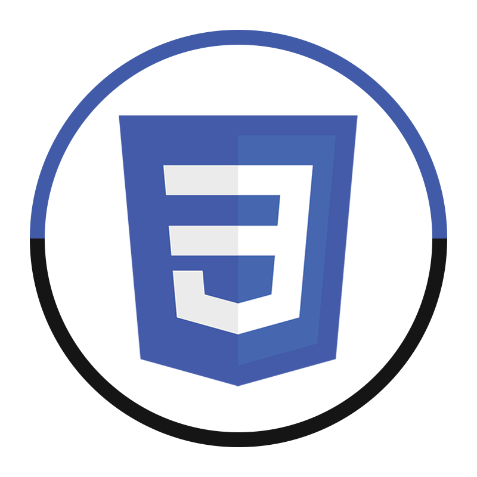
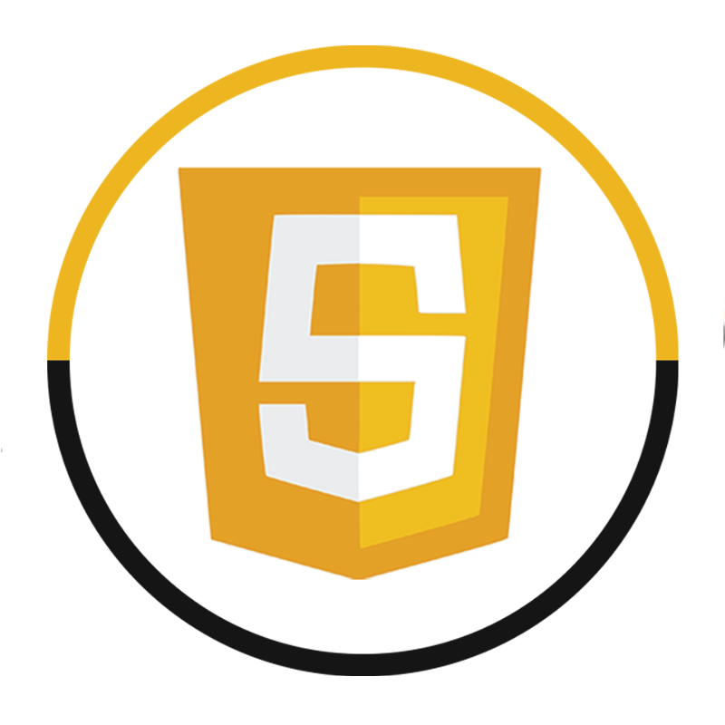
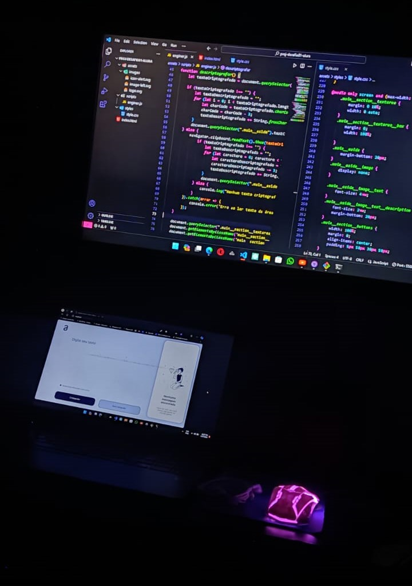

## 🚀🧑‍💻Challege#01 da Formação Iniciante em Programação T6 - ONE.  
<main style="text-align: justify">
Dando uma breve introdução sobre o desafio, o Challenge ONE Iniciante em Programação, consite em criar decodificador de texto com Javascript. DETALHES DESTE PROJETO:

- <a href="https://trello.com/b/EmUFmjCv/decodificador-de-texto-alura-challenges-oracle-one" title="trello-projeto">Trello</a>
- <a href="https://www.figma.com/file/tvFEYhVfZTjdJ5P24RGV21/Alura-Challenge---Desafio-1---L%C3%B3gica?type=design&node-id=16-802&mode=design&t=KH8gGgX5cptcFAHz-0" title="figma-projeto">Modelo Figma</a>
- <a href="https://cursos.alura.com.br/extra/alura-mais/como-front-end-utiliza-o-figma-c858" title="alura+-projeto">Alura+: Como um(a) desenvolvedor(a) front-end utiliza o Figma</a>

> Este desafio proposto foi uma ótima forma, de por em prática todo o contéudo revisado e absorvido, trabalhado durante a formação front-end.
###✨🗂️Skills utilizada no desenvolvimento deste desafio de código 
<div>
  
  
  
</div>

## 😄💻Um registro do ambiente de desenvolvimento  


## 📝✅Principais features do projeto
O projeto está entre aspas finalizado, pórem está aberto a receber novas dicas de funcionalidades, revisão e melhoria do código:

- [x] Criptografar texto (criptografia de cesar)
- [x] Descriptografar texto
- [x] Copiar o texto criptografado


## ⚡🤖 Sobre minha versão do desafio

Durante todo o projeto, o campo de texto estará disponível. Inicialmente, o botão "Criptografar" estará habilitado para clicar, enquanto o botão "Descriptografar" estará desabilitado. Após inserir uma palavra ou texto e clicar em "Criptografar", o botão "Criptografar" se tornará desabilitado, enquanto o botão "Descriptografar" se tornará habilitado. Existem duas formas de descriptografar o texto: a primeira é clicar no botão "Copiar" para copiar o texto criptografado e, em seguida, clicar no botão "Descriptografar"; a segunda é digitar a mensagem desejada na caixa de texto e clicar em "Descriptografar". Após clicar em "Descriptografar", o botão "Criptografar" se tornará habilitado novamente, enquanto o botão "Descriptografar" voltará a ficar desabilitado.

Para controlar a habilitação dos botões, utilizamos a propriedade CSS pointer-events:

Para habilitar:
```
pointer-events: auto;
```

Para desabilitar:

```
pointer-events: none;
```

## 💭🔣 Método de Criptografia: Criptografia de Cesar
Para usar <nome_do_projeto>, siga estas etapas:
A criptografia de César é um método de criptografia clássico no qual cada letra em um texto é substituída por outra letra, deslocando o alfabeto por um número fixo de posições.
Por exemplo, com um deslocamento de três posições, "A" seria substituído por "D", "B" por "E" e assim por diante.
```
Ex: jailson >>> mdlovrq
```

O nome vem do imperador romano Júlio César, que teria usado esse método para se comunicar com seus generais. É uma técnica simples e eficaz, mas facilmente quebrada por meio de análise estatística ou tentativa e erro.

A descriptografia na criptografia de César envolve o inverso do processo de criptografia. Ou seja, cada letra cifrada é deslocada para trás no alfabeto pelo mesmo número de posições usado na criptografia. Por exemplo, se o texto cifrado foi deslocado três posições para a direita, para decifrá-lo, deslocamos cada letra três posições para a esquerda. Isso resulta na recuperação do texto original. O processo é simples e direto, exigindo apenas conhecimento do método de criptografia utilizado e do número de posições deslocadas.
```
Ex: mdlovrq >>> jailson
```
## 🖥️💻📱 Projeto web Responsivo aos diversos tipos de tela

Para tornar esse projeto responsivo, utilizei as medias queries css:

1. Resolução para Ipad:
```
@media only screen and (max-width: 1024px)
```
2. Resolução para Celular:
```
@media only screen and (max-width: 768px)
```
As media queries em CSS são uma ferramenta poderosa que permite aos desenvolvedores web aplicar estilos específicos com base nas características do dispositivo, como largura da tela, altura da tela, orientação e resolução. Elas são fundamentais para criar layouts responsivos que se adaptem automaticamente a diferentes dispositivos e tamanhos de tela.
Para saber mais, consulte a documentação das medias queries css em  [Usando Media Queries - CSS | MDN - MDN Web Docs](https://developer.mozilla.org/pt-BR/docs/Web/CSS/CSS_media_queries/Using_media_queries).

## 🧑‍💻🤝 Desenvolvedor(es)

Abaixo as pessoas que contribuíram para este projeto:

<table>
  <tr>
    <td align="center">
      <a href="#" title="defina o titulo do link">
        <br>
        <sub>
          <b>Jailson Souza</b>
        </sub>
      </a>
    </td>
  </tr>
</table>

## 🚩😄 Sinta-se a vontade para contribuir com o projeto

Crie um fork do projeto e detalhes as contribuições feitas.
</main>
